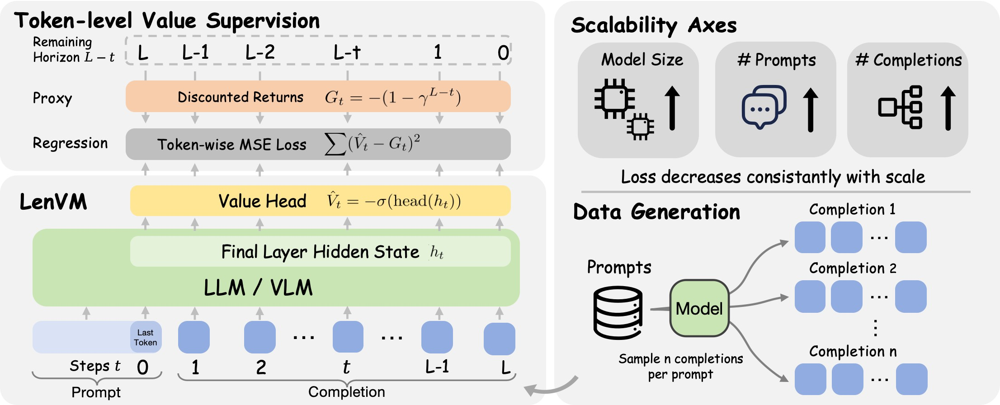

<div align="center">

# Length Value Model

**Scalable Value Pretraining for Token-Level Length Modeling**

[](https://length-value-model.github.io/)
[](./LenVM_paper.pdf)
[](https://github.com/eric-ai-lab/Length-Value-Model)
[](https://huggingface.co/collections/namezz/length-value-model)



</div>

---

Token serves as the fundamental unit of computation in modern autoregressive models, and generation length directly influences both inference cost and reasoning performance. Despite its importance, existing approaches lack fine-grained length modeling, operating primarily at the coarse-grained sequence level. We introduce the **Length Value Model (LenVM)**, a token-level framework that models the remaining generation length at each decoding step. By formulating length modeling as a value estimation problem and assigning a constant negative reward to each generated token, LenVM predicts a bounded, discounted return that serves as a proxy for the remaining generation horizon.

Project page: [https://length-value-model.github.io/](https://length-value-model.github.io/)

Data and models: [https://huggingface.co/collections/namezz/length-value-model](https://huggingface.co/collections/namezz/length-value-model)

## What is in this repository

This repository contains the integrated LenVM workflow:

- data generation through an OpenAI-compatible SGLang server
- LenVM training with a local LlamaFactory fork
- LenVM value-model serving and guided decoding with a local SGLang fork
- length prediction, length-token, LIFEBench, tradeoff, and visualization evaluations

## Repository structure

```text
.
├── scripts/                 # Canonical entrypoints for setup, data, training, inference, visualization
├── data_generation/         # Dataset generation pipeline and advanced data-generation reference
├── inference/               # Length prediction, length-token analysis, LIFEBench, tradeoff, visualization
├── LlamaFactory-LenVM/      # Local LlamaFactory fork with LenVM training support
├── sglang-LenVM/            # Local SGLang fork with LenVM serving and guided decoding support
├── docs/                    # Repo-level setup, workflow, and architecture docs
├── assets/                  # Figures used by documentation
└── pyproject.toml           # Python 3.12 uv workspace and dependency groups
```

## Prerequisites

- Python 3.12
- `uv`
- CUDA-capable GPU environment for training and SGLang inference demos
- Hugging Face access for downloading published data/model artifacts

Most scripts assume they are run from the repository root. The setup script creates separate environments for training, inference, and evaluation.

## Quick start: run the demo pipeline

The demo scripts are the recommended reproducible path for this repository. They run a compact end-to-end flow that reproduces most of the paper's results. Before launching the Slurm demo, configure the remote/local paths, environment variables, cache locations, and Slurm resources in `scripts/remote_slurm_job/submit_job.sh` (copy from `submit_job.sh.example`) and `.env` (copy from `.env.example`). The wrapper can sync and submit from a local machine, or submit directly when run on the remote server. The default path submits `train.slurm` with `sbatch`. If you are already on a GPU machine, you can also run `train.slurm` with `bash`; in that case, set GPU number `SLURM_GPUS_ON_NODE` yourself. On two H100 GPUs, the full demo takes about 1 hour and writes outputs to `results/`.

```bash
# Copy the template, then configure paths, environment variables, cache locations, Slurm resources, and IS_REMOTE mode.
cp scripts/remote_slurm_job/submit_job.sh.example scripts/remote_slurm_job/submit_job.sh
cp .env.example .env
bash scripts/remote_slurm_job/submit_job.sh
```

The Slurm demo covers data generation, LenVM training, evaluation (LIFEBench, tradeoff curve, length prediction, length-token analysis), and visualization of length-change trends.

You can also run the same stages manually:

```bash
# 1. Create/update .venv-train, .venv-infer, and .venv-eval
bash scripts/environment/env_config_uv.sh

# 2. Generate demo training/evaluation data
bash scripts/data_generation/demo.sh

# 3. Train the demo LenVM checkpoint
bash scripts/training/demo.sh

# 4. Run demo evaluations and visualization
bash scripts/inference/demo_length_prediction.sh
bash scripts/inference/demo_length_token.sh
bash scripts/inference/demo_lifebench.sh
bash scripts/inference/demo_tradeoff.sh
bash scripts/visualization/demo_visual.sh
```

You can also download existing data and model artifacts to skip the data-generation and training stages:

```bash
bash scripts/download_data_and_model.sh
```

The downloaded artifacts may require adjusting script parameters such as model paths, checkpoint paths, ports, tensor/pipeline parallelism, or memory fractions before running a specific evaluation. Full paper-result scripts are not included yet and will be provided later.

For stage-by-stage inputs, outputs, and alternatives, see [docs/workflows.md](docs/workflows.md).

## Documentation map

- [Getting started](docs/getting-started.md): environment setup, artifact download, and first smoke test.
- [Workflows](docs/workflows.md): published-assets and from-scratch LenVM workflows.
- [Repository structure](docs/repository-structure.md): how data generation, training, serving, and evaluation components fit together.
- [Advanced data generation](data_generation/data_generation.md): detailed generation commands and dataset-specific variants.
- [LIFEBench](inference/LIFEBench/README.md): benchmark-specific instructions and background.

The subproject READMEs in `LlamaFactory-LenVM/` and `sglang-LenVM/` are useful implementation references, but the root README and `docs/` directory describe the integrated LenVM workflow for this repository.

## Artifact locations

Large generated or downloaded artifacts are expected in these directories:

- `data_generation/LenVM-Data/`: generated and downloaded datasets
- `models/`: downloaded model artifacts
- `saves/`: trained LenVM checkpoints
- `results/`: evaluation and visualization outputs
- `cache/`: tokenized or intermediate caches

Avoid committing large generated artifacts unless explicitly required.

## Citation

If you find this work useful, please cite:

```bibtex
@misc{zhang2026lengthvaluemodelscalable,
      title={Length Value Model: Scalable Value Pretraining for Token-Level Length Modeling}, 
      author={Zhen Zhang and Changyi Yang and Zijie Xia and Zhen Yang and Chengzhi Liu and Zhaotiao Weng and Yepeng Liu and Haobo Chen and Jin Pan and Chenyang Zhao and Yuheng Bu and Alkesh Patel and Zhe Gan and Xin Eric Wang},
      year={2026},
      eprint={2604.27039},
      archivePrefix={arXiv},
      primaryClass={cs.CL},
      url={https://arxiv.org/abs/2604.27039}, 
}
```
